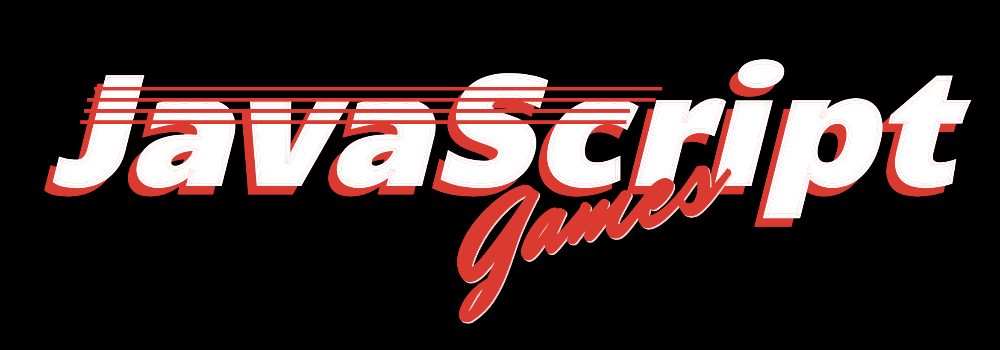

  
  
  

<h1 align="center">Awesome JavaScript Games</h1>
<h4 align="center">A curated list of awesome JavaScript Games (Open Source), assets and resources.</h4>

  
  

    <i>Credits to https://codepen.io/boldfacedesign/pen/EoGgD</i>
  

### Winners
- [js13kGames 2019](https://github.blog/2019-10-08-js13k-2019-highlights) - Highlights from the js13kGames 2019 competition.
- [js13kGames 2018](https://github.blog/2018-10-05-js13kgames-highlights-2018) - 13 Games in ≤ 13kB of JavaScript.
- [js13kGames 2017](https://github.blog/2017-07-31-build-a-game-in-13kb-or-less-with-js13kgames) - Build a game in 13kB or less with js13kGames.

### Adventure
- [Bounce Back](https://js13kgames.com/entries/bounce-back) - Boomerang adventure game for JS13k!
- [Offline Paradise](https://js13kgames.com/entries/offline-paradise) - The world, a paradise, has gone offline; everything has become grey and dangerous. Traverse, jump and dash over the obstacles to turn the world back into normal.
- [Planetfall](https://js13kgames.com/entries/planetfall) - A space exploration game. The goal is to find satellite stations on each planet and take them offline.
- [Quest of Tod](https://js13kgames.com/entries/quest-of-tod) - A speed running adventure game, where you stuck inside unknown place controlled by strange machine. Can you find all the keys and codes to unlock the exit before the time runs out?.

### Arcade
- [Everyone's Sky](https://js13kgames.com/entries/everyones-sky) - Make allies by completing missions, study other planets, stars, defend yourself against planetary defenses and pirate groups, or makes enemies by attacking them, ignoring their communications and destroying their facilities.
- [Evil glitch](https://js13kgames.com/entries/evil-glitch) - Strange glitches appear in your dimension, could you stop them to assimilate your world?
- [Off The Line](https://js13kgames.com/entries/off-the-line) - Jump off the line and try not to die or throw your keyboard across the room in this twitchy arcade tapper.
- [Behind Asteroids, The Dark Side](https://js13kgames.com/entries/behind-asteroids-the-dark-side) - A game about throwing asteroids to people playing "Asteroids" on an arcade machine.
- [Pest Control: Weasels](https://js13kgames.com/entries/pest-control-weasels) - Lemmings were meant to be saved, weasels should instead be disposed of. (consider this as your revenge on small pesky critters!).

### Platformer
- [ONOFF](https://js13kgames.com/entries/onoff) - Navigate through 25 brain-teasing levels in this fast-paced, hand-crafted platformer. You'll dodge spikes, jump over pits, and toggle between dimensions.
- [The Matr13k](https://js13kgames.com/entries/the-matr13k) - After saving Morpheus, Neo needs to find an exit from this JavaScript version of the matrix.
- [Glitch Buster](https://js13kgames.com/entries/glitch-buster) - Can you fix all 13 glitches before time runs out? Avoid the dangerous pointers, or kill them by jumping on their heads!
- [Vier](https://js13kgames.com/entries/vier-wizard-wars) - You have the power to control the 4 elements with the VIER stone, It's time to destroy all the wizards and become the ruler of the universe.
- [Way Out](https://js13kgames.com/entries/way-out) - The door is locked. You'll have to explore a dangerous dungeon full of traps and monsters and find 4 lost gems to open the door and get your WAY OUT!

### Puzzle
- [1024 Moves](https://js13kgames.com/entries/1024-moves) - This puzzle can be solved in 1024 movements.
- [Re-Wire](https://js13kgames.com/entries/re-wire) - Bring the system back online by rewiring the power nodes.
- [Envisionator](https://js13kgames.com/entries/envisionator) - A short puzzle game about escaping a building lockdown with the aid of your trusty robot friend.
- [Planet Figadore has gone OFFLINE](https://js13kgames.com/entries/planet-figadore-has-gone-offline) - Fred lives on planet Figadore in the Hercules cluster, he likes watching cat videos from planet Earth via Parallax Shift, but the network link has gone OFFLINE!
- [Enmeshed](https://js13kgames.com/entries/enmeshed) - A hacking puzzle / strategy game. Exploit vulnerabilities in nodes and connections to knock a dynamically-routed mesh network offline. 
- [Raven](https://js13kgames.com/entries/raven) - The security cameras for a secret facility have been taken offline, and it is YOUR job to fix the problem.
- [Lost Treasure](https://js13kgames.com/entries/lost-treasure) - 'Lost Treasure' is a short retro style puzzle-platformer game. There are 7 different levels (for now) to go through and collect treasure back to little Flo.

### Shooter
- [The Chroma Incident](https://js13kgames.com/entries/the-chroma-incident) - The Achromats have taken the worlds color offline! Raid their colorless lair and vanquish them all, restoring the world to it's technicolor glory.
- [UNDERRUN](https://js13kgames.com/entries/underrun) - A twin stick shooter in 256 shades of brown.

### Strategy
- [Elematter](https://js13kgames.com/entries/elematter) - Elematter is a tower defense game based on the four elements: Earth, Water, Air and Fire.

### Virtual Reality
- [Back to Space](https://js13kgames.com/entries/back-to-space) - 40 Years ago we thought we had defeated them. But they are back! Now it's up to you!

### Web Components
- [Scroll!](https://github.com/ZeevKatz/scroll) - A Face to Face fighting game for mobile that you can play in your browser.

### Uncategorized
- [SPACECRAFT](https://js13kgames.com/entries/spacecraft) - "Space, the final frontier" is your ultimate destination in SPACECRAFT.
- [LOST ROBOT](https://js13kgames.com/entries/lost-robot) - If I'd written the mapping module, it wouldn't be offline!
- [Exo](https://js13kgames.com/entries/exo) - A space based tower defence game! Build satellites and stations around planets orbiting a distant star. Survive waves of enemies.
- [Submersible Warship 2063](https://js13kgames.com/entries/submersible-warship-2063) - Enemy submarines have invaded your perimeter. Stay off their radar and fight back!

---

  

### Game Engines
#### 2D
  - [GDevelop](https://github.com/4ian/GDevelop) - An open-source, cross-platform game engine designed to be used by everyone.
  - [melonJS](https://github.com/melonjs/melonjs) - A fresh & lightweight HTML5 game engine.
  - [PixiJS](https://github.com/pixijs/pixi.js) - The HTML5 Creation Engine: Create beautiful digital content with the fastest, most flexible 2D WebGL renderer.
  - [Phaser](https://github.com/photonstorm/phaser) - Desktop and Mobile HTML5 game framework. A fast, free and fun open source framework for Canvas and WebGL powered browser games.
  - [Cocos2d-x](https://github.com/cocos2d/cocos2d-x) - A multi-platform framework for building 2d games, interactive books, demos and other graphical applications.
  - [Craters.js](https://github.com/swashvirus/craters.js) - A Compact Game Engine that helps you build fast, modern HTML5 Games.
  - [BLACKSMITH 2D](https://github.com/MassiveHeights/Black) - Black is a highly optimized 2D framework for web, mobile games, and playable ads.
#### 3D
  - [Babylonjs](https://github.com/BabylonJS/Babylon.js) - A powerful, beautiful, simple, and open game and rendering engine packed into a friendly JavaScript framework.
  - [PlayCanvas](https://github.com/playcanvas/engine) - Fast and lightweight WebGL game engine.
  - [three.js](https://github.com/mrdoob/three.js) - JavaScript 3D library.
  
### Micro-libraries
- [Sound.js](https://github.com/kittykatattack/sound.js) - A micro-library to load, play and generate sound effects and music for games and interactive applications.
- [Simplify.js](https://github.com/mourner/simplify-js) - A high-performance JavaScript polyline simplification library by Vladimir Agafonkin, extracted from Leaflet.
- [ZzFX](https://github.com/KilledByAPixel/ZzFX) - A Tiny JavaScript Sound Effect Engine.
- [SAT.js](https://github.com/jriecken/sat-js) - A simple JavaScript library for performing 2D collision detection.
- [jsfxr](https://www.npmjs.com/package/jsfxr) - [as3fxr](https://code.google.com/p/as3sfxr) synth port to JavaScript created for js13kGames.
- [Kontra](https://straker.github.io/kontra) - A lightweight JavaScript gaming micro-library created specifically for the Js13kGames game jam.
- [Hexi](https://github.com/kittykatattack/hexi) - A fun and easy way to make HTML5 games or any other kind interactive media using pure JavaScript code.
- [js13k-2d](https://github.com/kutuluk/js13k-2d) - A 2kb webgl 2d sprite renderer, designed for Js13kGames.
- [IonPhaser](https://github.com/proyecto26/ion-phaser) - A web component to use Phaser Framework with Angular, React, Vue, etc 🎮
- [Animatable](https://github.com/proyecto26/animatable-component) - Animate once, use Everywhere! 💫
- [minivents](https://github.com/allouis/minivents) - Tiny eventing for javascript.

### Graphics
- [p5.js](https://github.com/processing/p5.js) - A client-side JS platform that empowers artists, designers, students, and anyone to learn to code and express themselves creatively on the web. It is based on the core principles of Processing.
- [Paper.js](https://github.com/paperjs/paper.js) - The Swiss Army Knife of Vector Graphics Scripting.

### Physics
- [Matter.js](https://github.com/liabru/matter-js) - A JavaScript 2D rigid body physics engine for the web.

### Virtual Reality
- [A-Frame](https://github.com/aframevr/aframe) - A web framework for building virtual reality experiences.

### Audio Resources
- [A port of sfxr to HTML5](https://github.grumdrig.com/jsfxr) - Dead easy game sound effects generator.
- [TinyMusic](https://github.com/kevincennis/TinyMusic) - A simple, lightweight music synth/sequencer in JavaScript using the Web Audio API.
- [SoundBox](https://github.com/mbitsnbites/soundbox) - A tool for composing synthetic music, in your browser.
- [Sonant-X](https://github.com/nicolas-van/sonant-x) - A very small JavaScript synthesizer library, suitable for small JavaScript demos or video games.

### Visual Resources
- [OpenGameArt.org](https://opengameart.org) - Free, legal art for open source game projects (includes models, sprites, textures, sounds, music).
- [NFG's Arcade Font Engine](https://nfggames.com/games/fontmaker) - Font for your games.
- [The Spriters Resource](https://www.spriters-resource.com) - The #1 source for video game sprites on the internet!
- [Sprite Database](https://spritedatabase.net) - Sprite rips from classic games.
- [TinyPNG](https://tinypng.com) - Compress PNG images while preserving transparency.
- [Arcade Font Writer](http://arcade.photonstorm.com) - Create your own text using hundreds of fonts from classic Arcade games.
- [ShoeBox](https://renderhjs.net/shoebox) - A free Adobe Air based app for Windows and Mac OSX with game and ui related tools.

### Real-Time
- [Snapshot Interpolation](https://github.com/geckosio/snapshot-interpolation) - A Snapshot Interpolation library for Real-Time Multiplayer Games.

### Editors
- [Tiled Map Editor](https://github.com/bjorn/tiled) - A flexible level editor.
- [Phaser Editor 2D](https://phasereditor2d.com) - A web-based IDEfor HTML5 game development.
- [Aseprite](https://www.aseprite.org) - Animated sprite editor & pixel art tool.
- [Piskel](https://github.com/piskelapp/piskel) - A free online editor for animated sprites & pixel art.

### Generators
- [Stitches](https://draeton.github.io/stitches) - An HTML5 sprite sheet generator.
- [Audiosprite](https://github.com/tonistiigi/audiosprite) - A ffmpeg wrapper that will take in multiple audio files and combines them into a single file.

### Minification
- [Rollup](https://github.com/rollup/rollup) - A module bundler for JavaScript which compiles small pieces of code into something larger and more complex, such as a library or application.
- [webpack](https://github.com/webpack/webpack) - Bundle JavaScript files for usage in a browser, yet it is also capable of transforming, bundling, or packaging just about any resource or asset.
- [UglifyJS](https://github.com/mishoo/UglifyJS) - A JavaScript parser, minifier, compressor and beautifier toolkit.
- [Brunch](https://github.com/brunch/brunch) - Fast front-end web app build tool with simple declarative config and seamless incremental compilation for rapid development.
- [Gulp](https://github.com/gulpjs/gulp) - A toolkit to automate & enhance your workflow.
- [Grunt](https://github.com/gruntjs/grunt) - The JavaScript Task Runner.

### Build
- [Electron](https://github.com/electron/electron) - Build cross-platform desktop apps with JavaScript, HTML, and CSS.
- [NW.js](https://github.com/nwjs/nw.js) - Call all Node.js modules directly from DOM/WebWorker and enable a new way of writing applications with all Web technologies.
- [Cordova](https://github.com/apache/cordova) - Mobile apps with HTML, CSS & JS. Target multiple platforms with one code base.
- [Capacitor](https://github.com/ionic-team/capacitor) - Build cross-platform Native Progressive Web Apps for iOS, Android, and the web ⚡️

### Compilers
- [Babel](https://github.com/babel/babel) - The compiler for writing next generation JavaScript.
- [Emscripten: An LLVM-to-Web Compiler](https://github.com/emscripten-core/emscripten) - Compiles C and C++ to WebAssembly using LLVM and Binaryen. Emscripten output can run on the Web, in Node.js, and in wasm runtimes.

### Templates
- [js13kserver](https://github.com/js13kGames/js13kserver) - js13kGames Server category files and rules.
- [JS13K A-Frame Boilerplate](https://github.com/mguinea/js13k-aframe-boilerplate) - An A-Frame boilerplate for the js13k competition.

### Guides
- [Google JavaScript Style Guide](https://google.github.io/styleguide/jsguide.html).
- [WebGL guide](https://xem.github.io/articles/webgl-guide) - A complete, summarized WebGL tutorial, with tiny interactive demos in each chapter.
- [Math for games](https://gist.github.com/xem/99930986c5333125a13b0ea50600391f) - Maths & trigonometry cheat sheet for 2D & 3D games.
- [browserdiet.com](https://browserdiet.com) - The definitive front-end performance guide.
- [JavaScript Garden](https://bonsaiden.github.io/JavaScript-Garden) - A growing collection of documentation about the most quirky parts of the JavaScript programming language.

### Books
- [Phaser 3 HTML5 Cross Platform Game Development - Endless Runner](https://gumroad.com/l/FcjQw) - Designed both for beginners and skilled programmers, the course guides you from an empty folder introducing the bare bones of JavaScript to advanced Phaser 3 features.
- [HTML5 Cross Platform Game Development Using Phaser 3](https://gumroad.com/l/odKJf) - The first Phaser 3 guide to the creation of HTML5 cross platform games using Phaser 3 framework and other free software.
- [From null to full HTML5 cross platform game](https://gumroad.com/l/HIEux) - Each step of the book is provided with its source code example, for a total of 79 pages and 27 source code examples.
- [Interphase #1](https://gumroad.com/l/ySfMa) - A 400 page bookazine complete with a coverdisk filled with source code, graphics and more for Phaser CE.
- [A Guide to the Phaser CE Tween Manager](https://leanpub.com/phasertweenmanager) - Learn how to use the Phaser Tween Manager to its full potential and spice up your games.
- [A Guide to the Phaser CE Scale Manager](https://leanpub.com/phaserscalemanager) - Phaser has a powerful built-in Scale Manager and this guide teaches you how to unlock its features.

### Competitions
- [Js13kGames](https://js13kgames.com) - Create HTML5 games that will fit in a zip package of only 13 kilobytes.
- [Ludum Dare](https://ldjam.com/games) - An online event where games are made from scratch in a weekend.
- [Node Knockout](https://www.nodeknockout.com) - The world's biggest Node.js programming competition.

### Courses
- [Codecademy](https://www.codecademy.com/catalog/language/javascript) - JavaScript Courses & Tutorials.
- [CodeCombat: Learn to Code by Playing a Game](https://github.com/codecombat/codecombat) - Learn programming with a multiplayer live coding strategy game for beginners.
- [Codewars](https://www.codewars.com) - Achieve mastery through challenge.

### Tutorials
- [Game Mechanic Explorer](https://gamemechanicexplorer.com) - A collection of concrete examples for various game mechanics, algorithms, and effects.
- [Procedurally Generated Dungeon](https://craiky.github.io/tutorial) - A Procedurally Generated Dungeon Tutorial in Java-Script.
- [Gamedev Tuts+](https://gamedev.tutsplus.com) - The best place to find game development tutorials.
- [Codrops](https://tympanus.net/codrops/category/tutorials) - Useful tutorials, insightful articles, creative inspiration and free resources for web designers and developers.
- [Emanuele Feronato](https://www.emanueleferonato.com) - Posts about Game design, HTML5, Phaser, JavaScript, Monetize, Box2D, Unity3D.

### Workshops
- [Chrome Experiments](https://experiments.withgoogle.com) - A showcase of work by coders who are pushing the boundaries of web technology, creating beautiful, unique web experiences.
- [VR Workshop](https://github.com/marpi/vr) - VR Workshop at Gray Area Festival.
- [Immersive](https://github.com/marpi/immersive) - Immersive Three.js Workshop at Gray Area.
- [Phaser CE Workshop using ES6](https://github.com/proyecto26/Phaser-Workshop) - Isometric worlds and Real Time games.

### Forums
- [HTML5 Game Devs Forum](https://www.html5gamedevs.com) - A forum about Phaser, Pixi, Babylon, Panda 2, melonJS, Collaborations, Services and Jobs!

### Distribution
- [5 Apps](https://5apps.com) - Deployment and distribution tools.
- [GamePix](https://company.gamepix.com) - Platform for developers and publishers with interesting blog posts.
- [MarketJS](https://www.marketjs.com) - A B2B Platform for licensing HTML5 games. Buy HTML5 games, customize and deploy instantly to your server.
- [itch.io](https://itch.io) - Distribution and game jam hosting platform for HTML5 games.
- [CrazyGames](https://www.crazygames.com/t/html5) - New distribution platform for HTML5 games.
- [Y8 Games](https://www.y8.com) - At Y8 Games, there are over 70,000 games and videos available to play online. We are leading in the latest Unity3D car and dress up games.

### Monetization
- [GameDistribution](https://gamedistribution.com) - The biggest broker of high quality, cross-platform games. We connect the best game developers to the biggest publishers.
- [Awesome Web Monetization](https://github.com/thomasbnt/awesome-web-monetization) - Awesome stuffs about Web Monetization. Learn more, check modules and others tools.

### Testing
- [stats.js](https://github.com/mrdoob/stats.js) - JavaScript Performance Monitor.
- [Leshy SpriteSheet Animator](https://www.leshylabs.com/apps/spriteSheetAnimator) - Online Sprite Sheet Animation Utility.

### Security
- [Jscrambler](https://jscrambler.com) - A JavaScript interpreter and parsing engine that creates an Abstract Syntax Tree representing your source code to make it extremely difficult to reverse engineer.

### Other Awesome Lists
- [awesome-phaser](https://github.com/Raiper34/awesome-phaser) - A curated list of awesome Phaser libraries, resources and shiny things.
- [jsGameWiki](https://github.com/DaRaFF/jsgamewiki) - A collection of good links for gaming with javascript.
- [Games on GitHub](https://github.com/leereilly/games) - A list of popular/awesome videos games, add-ons, maps, etc. hosted on GitHub. Any genre. Any platform. Any engine.

## Contributors ✨
Please do contribute! Issues and pull requests are welcome.

## Supporting 🍻
I believe in Unicorns 🦄
Support [me](https://www.paypal.me/jdnichollsc/2), if you do too.

## Happy coding 💯
Made with ❤️

